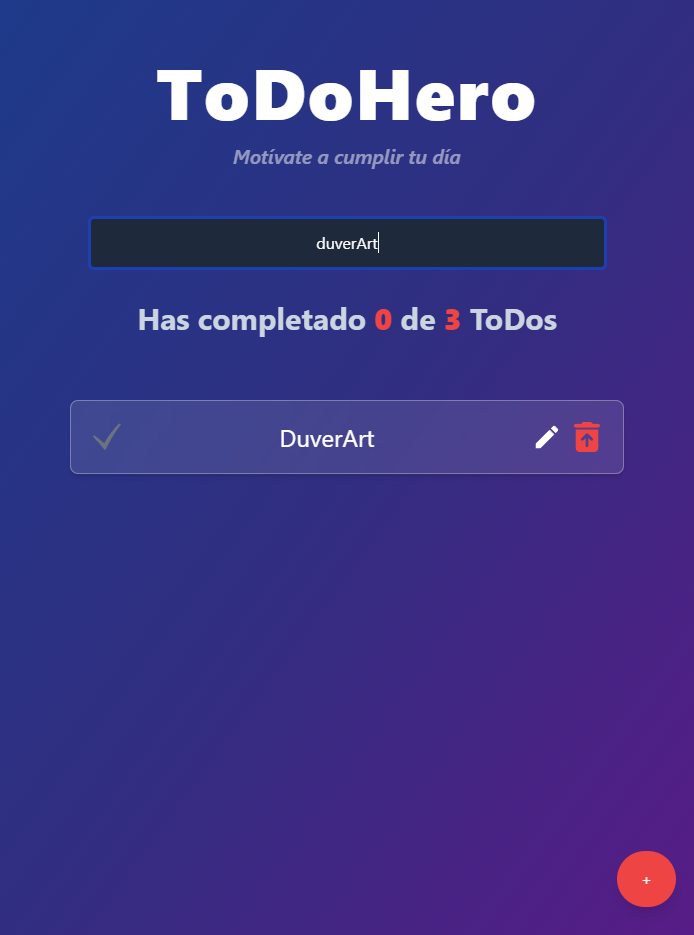
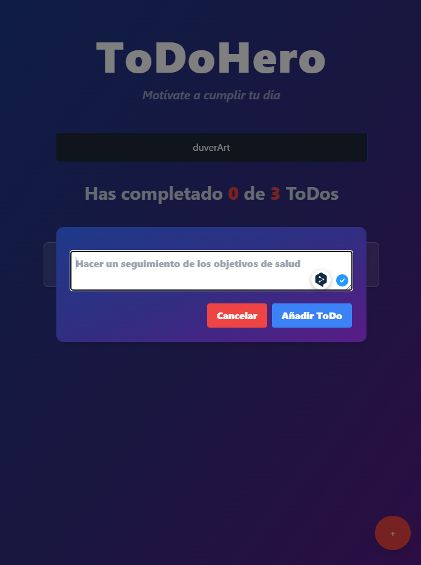

# ToDoHero

**¡Bienvenido a ToDoHero!**
ToDoHero es una aplicación diseñada para motivarte a cumplir tus tareas diarias de una manera sencilla y visualmente atractiva.

## Descripción

ToDoHero te permite crear, buscar y completar tareas pendientes (ToDos) de manera eficiente. La aplicación cuenta con un diseño moderno y funcional, y está construida utilizando **React**, **Tailwind CSS** y varias librerías de interfaz de usuario para mejorar la experiencia visual. Además, cuenta con un sistema de modal personalizado para editar las tareas.

## Funcionalidades

- Crear nuevos ToDos
- Editar ToDos existentes
- Marcar como completado y eliminar ToDos
- Barra de búsqueda para filtrar ToDos
- Diseño responsivo y atractivo
- Alertas y mensajes de error manejados visualmente

## Tecnologías Utilizadas

- **Frontend**: React, Vite, Tailwind CSS
- **Librerías**: `shadcn/ui`, `react-icons`, `lucide-react`, `canvas-confetti`
- **Herramientas de Construcción**: Vite, ESLint
- **Otros**: Modales personalizados con `createPortal`, animaciones y gradientes.

## Instalación

1. Clona el repositorio:
    ```bash
    git clone https://github.com/DuverArt/ToDoHero.git
    ```

2. Instala las dependencias:
    ```bash
    npm install
    ```

3. Ejecuta la aplicación:
    ```bash
    npm run dev
    ```

4. Abre tu navegador en `http://localhost:5173/` para ver la aplicación.

## Uso

1. Agrega nuevas tareas utilizando el botón flotante en la esquina inferior derecha.
2. Utiliza la barra de búsqueda para encontrar tareas específicas.
3. Marca las tareas como completadas o elimínalas cuando ya no sean necesarias.
4. Edita tareas utilizando la ventana modal emergente.

## Capturas de Pantalla

### Pantalla Principal





## Contribuciones

Las contribuciones a ToDoHero están abiertas, siempre y cuando no se usen con fines comerciales. Puedes contribuir abiertamente al código, pero si tienes alguna idea para mejorar la funcionalidad o el diseño, eres bienvenido a compartir.

## Licencia

Este proyecto está licenciado bajo la **Creative Commons Attribution-NonCommercial 4.0 International (CC BY-NC 4.0)**.

Puedes compartir, copiar y modificar el contenido de este proyecto siempre y cuando se dé crédito adecuado y **no se utilice con fines comerciales**. Para ver la licencia completa, visita [Creative Commons Attribution-NonCommercial 4.0](https://creativecommons.org/licenses/by-nc/4.0/).
